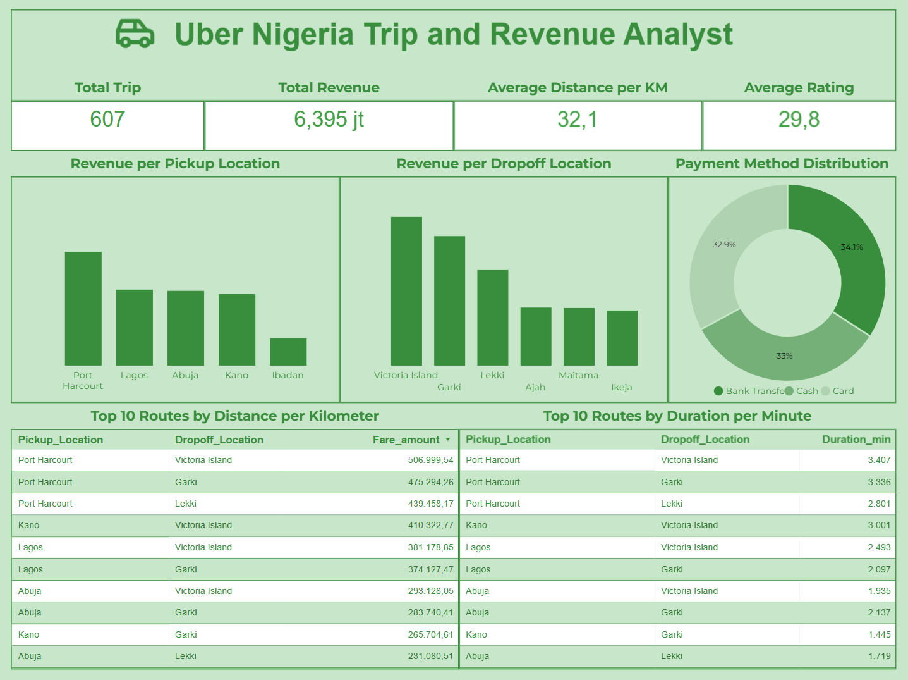

# Project Background

Uber Nigeria is experiencing increasing travel demand; however, poor data quality—such as incomplete records, duplicate entries, and invalid values limits the ability to accurately analyze revenue performance, customer behavior, and operational efficiency.

This project focuses on data cleaning and standardization to improve data accuracy and reliability. By preparing high quality data, the analysis aims to support better business insights, operational strategies, and long-term growth decisions for Uber Nigeria.

An interactive Looker Studio dashboard used to report can be found [here](https://lookerstudio.google.com/reporting/2e401350-fe8f-4c58-b418-0bca4883e5b3).

# Data Structure & Initial Checks

.png)

# Executive Summary

This analysis evaluates cleaned and standardized Uber Nigeria trip data to identify revenue drivers, payment behavior, and route profitability. The results show that Port Harcourt is the highest-revenue pickup location, while **Victoria Island** generates the highest drop-off revenue. Additionally, **Port Harcourt – Victoria Island** emerges as the most profitable route, driven by longer trip durations, and **Bank Transfer** is the most frequently used payment method.

# Insights Deep Dive

### Location Performance

- Port Harcourt is the pickup location with the highest total revenue.

- Victoria Island is the drop-off location generating the highest revenue.

- High-performing locations indicate strong customer demand and operational efficiency.

### Payment Method Analysis

- Bank Transfer is the most frequently used payment method.

- Usage frequency of Bank Transfer is only slightly higher than Cash and Card, indicating relatively balanced payment preferences.

- Offering multiple payment options remains important for customer convenience.

### Route Profitability

- The Port Harcourt – Victoria Island route generates the highest profit.

- This route has the longest average trip duration, which directly contributes to higher revenue.

- Longer routes play a significant role in overall profitability.

# Recommendations

- Maintain and optimize operations in high-revenue locations such as Port Harcourt and Victoria Island.

- Conduct deeper analysis and evaluation of low-performing locations to identify improvement opportunities.

- Expand and enhance payment method options to improve customer experience and transaction convenience.

- Develop and optimize other pickup locations by adopting strategies used in **Port Harcourt**, particularly for routes with high profitability potential.

# Assumptions and Caveats

- The analysis is based on cleaned historical trip data and does not account for external factors such as traffic conditions, fuel prices, or promotional campaigns.
